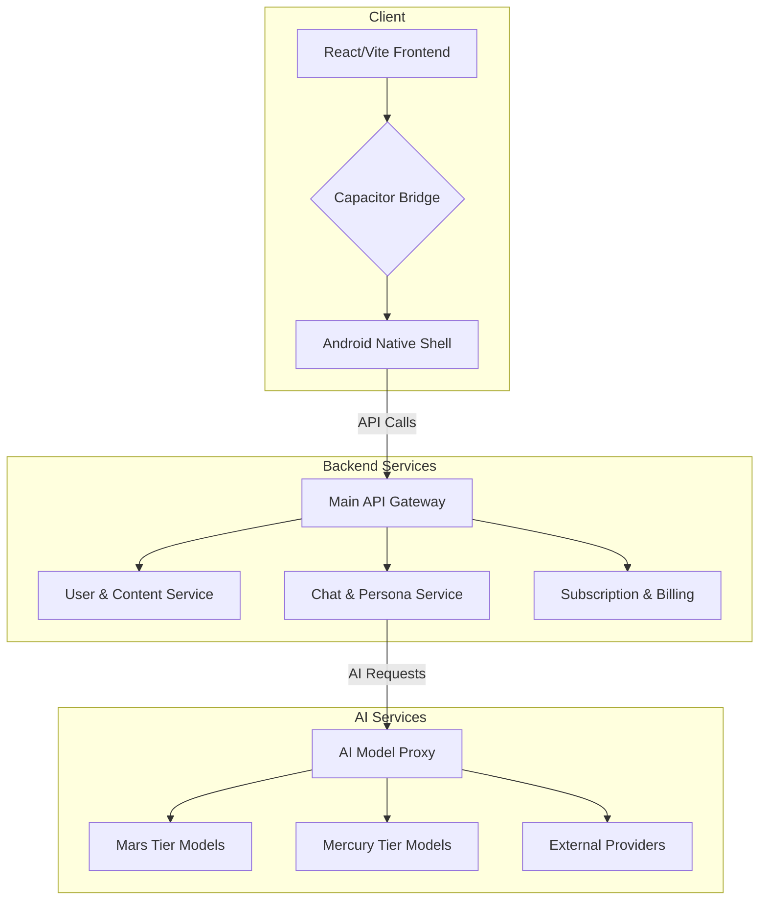

# Chub AI Application Analysis

This repository contains a comprehensive reverse-engineering analysis of the Chub AI mobile application (`ai.chub`), including formal specifications, technical documentation, and architectural diagrams.

## Overview

**Chub AI** is a hybrid mobile application that provides an AI-powered character chat platform. It is built using a modern web stack (React/Vite) and packaged as a native Android application using the Capacitor framework. The platform supports multiple AI model providers and features a sophisticated content management system for user-created characters, lorebooks, and interactive stages.

## Repository Contents

| File | Description |
| :--- | :--- |
| `analysis_summary.md` | High-level summary of the application's architecture, features, and key findings. |
| `technical_documentation.md` | Detailed technical documentation with Mermaid diagrams covering system architecture, data models, and API design. |
| `aichub_formal_spec.zpp` | Formal Z++ specification defining the system's types, schemas, state space, and core operations. |
| `decompiled/` | Decompiled Java source code from the APK's `classes.dex` file. |
| `apk_contents/` | Extracted contents of the original APK file. |
| `zip_contents/` | Extracted contents of the companion ZIP archive. |

## Key Findings

The analysis revealed the following key architectural and functional characteristics:

1.  **Hybrid Architecture:** The application is a web-based SPA wrapped in a native Android shell using Capacitor, enabling cross-platform deployment from a single codebase.
2.  **Multi-Provider AI:** The system is designed to be model-agnostic, with a proxy layer that routes requests to various AI providers (OpenAI, Anthropic, OpenRouter, etc.) based on user subscription tiers.
3.  **Rich Content System:** A sophisticated system for managing user-generated content, including characters with detailed personality definitions and lorebooks for world-building, compatible with community standards like TavernAI/SillyTavern.
4.  **Tiered Monetization:** A subscription model with multiple tiers (Free, Mercury, Mars) that unlock access to different AI models and features.
5.  **Real-Time Capabilities:** Integration with LiveKit for real-time voice and video communication.
6.  **Self-Updating:** A custom Capacitor plugin allows the app to download and install APK updates, bypassing the app store.

## Architecture Diagram

## Formal Specification

The `aichub_formal_spec.zpp` file provides a formal, machine-readable specification of the system's core components using Z++ notation. This includes:

-   **Basic Types:** `URL`, `TIMESTAMP`, `UUID`
-   **Enumerations:** `SUB_TIER`, `AI_PROVIDER`, `CONTENT_RATING`, `USER_ROLE`, `MESSAGE_ROLE`
-   **Schemas:** `USER_SCHEMA`, `CHARACTER_SCHEMA`, `LOREBOOK_SCHEMA`, `CHAT_SCHEMA`, `MESSAGE_SCHEMA`
-   **Operations:** `CREATE_USER`, `CREATE_CHARACTER`, `SEND_MESSAGE`

## License

This analysis is provided for educational and research purposes only.
