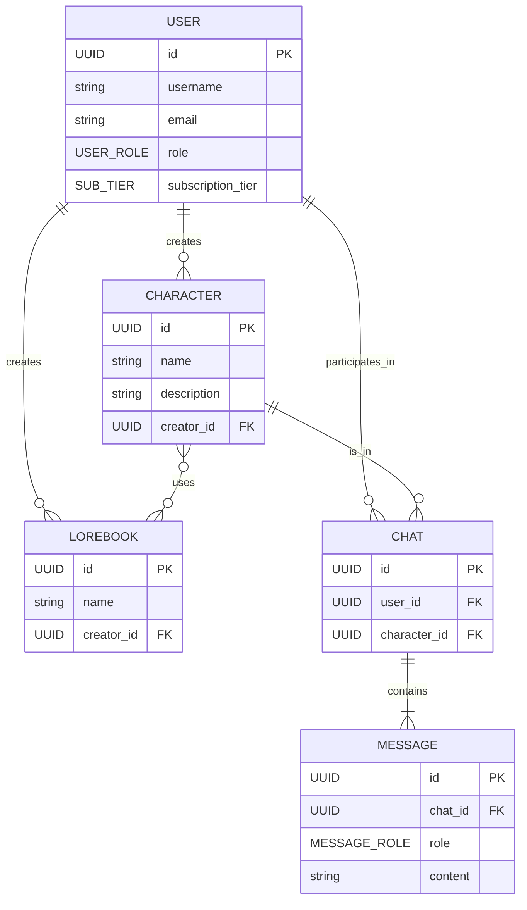
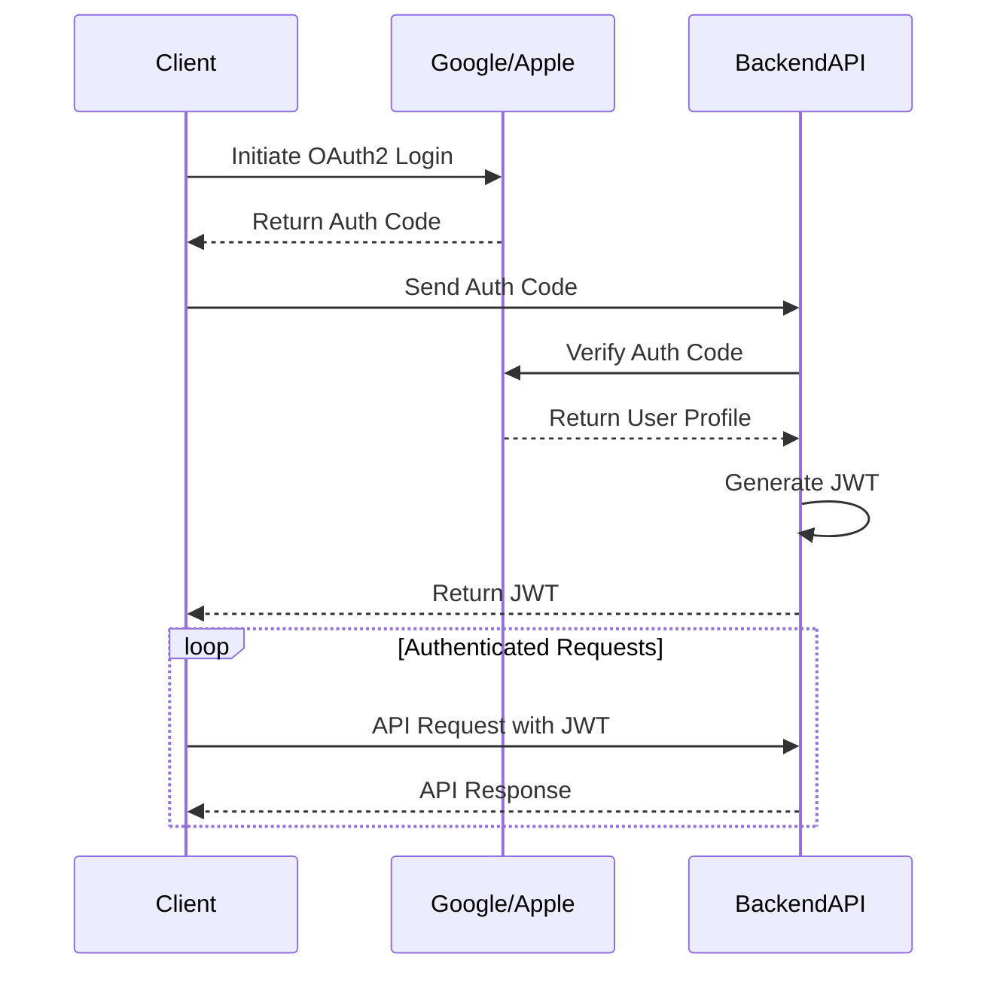
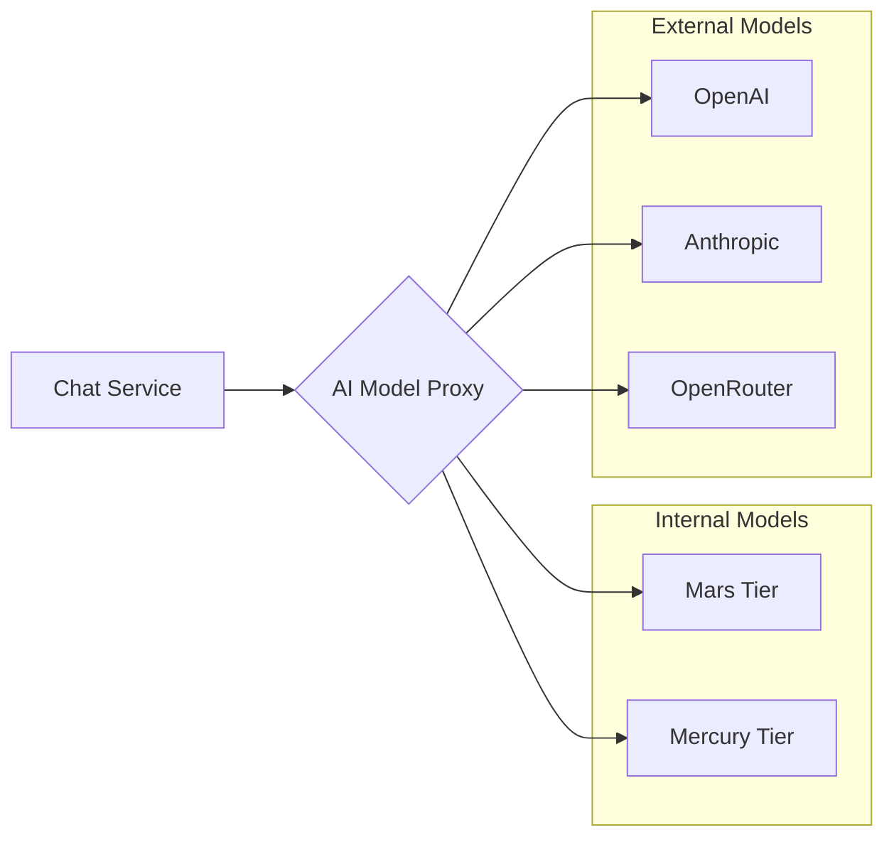

# Chub AI Technical Documentation

## 1. System Architecture

The Chub AI application is a hybrid system built on a modern web stack, packaged as a native mobile application using Capacitor. It leverages a microservices-oriented backend to deliver a rich, multi-provider AI chat experience.

```mermaid
graph TD
    subgraph Client
        A[React/Vite Frontend] --> B{Capacitor Bridge}
        B --> C[Android Native Shell]
    end

    subgraph Backend Services
        D[Main API Gateway] --> E[User & Content Service]
        D --> F[Chat & Persona Service]
        D --> G[Subscription & Billing]
        D --> H[Social & Notifications]
    end

    subgraph AI & 3rd Party Services
        I[AI Model Proxy] --> J[Mars Tier Models]
        I --> K[Mercury Tier Models]
        I --> L[OpenAI / Anthropic / etc.]
        M[LiveKit] -- Real-Time -- A
        N[ElevenLabs TTS] -- Voice -- A
        O[Google/Apple/PayPal] -- Payments -- G
    end

    C -- API Calls --> D
    A -- API Calls --> D
    E -- DB Access --> P[(User/Content DB)]
    F -- DB Access --> Q[(Chat/Persona DB)]
    F -- AI Requests --> I

    classDef client fill:#cde4ff,stroke:#333,stroke-width:2px;
    classDef backend fill:#d5e8d4,stroke:#333,stroke-width:2px;
    classDef services fill:#f8cecc,stroke:#333,stroke-width:2px;

    class A,B,C client;
    class D,E,F,G,H backend;
    class I,J,K,L,M,N,O services;
    class P,Q database;
```

### Component Descriptions

| Component | Description |
| :--- | :--- |
| **React/Vite Frontend** | The user interface, built as a single-page application. |
| **Capacitor Bridge** | Enables the web app to run natively and access device features. |
| **Android Native Shell** | The native Android container for the web application. |
| **Main API Gateway** | The single entry point for all client API requests. |
| **User & Content Service** | Manages user accounts, characters, lorebooks, and other user-generated content. |
| **Chat & Persona Service** | Handles real-time chat sessions, message history, and persona management. |
| **Subscription & Billing** | Integrates with payment providers to manage subscription tiers. |
| **AI Model Proxy** | A unified interface that routes requests to various internal and external AI models. |
| **LiveKit** | Provides real-time voice and video communication capabilities. |
| **ElevenLabs TTS** | Provides text-to-speech functionality for voice output. |

## 2. Data Model

The core data model revolves around Users, Characters, and their interactions through Chats. Lorebooks provide additional context, and Personas allow users to customize their identity.



### Key Entities

- **USER:** Represents a registered user of the application. Each user has a role and a subscription tier that determines their access level.
- **CHARACTER:** An AI entity created by a user. It has a defined personality, scenario, and other attributes that guide its behavior.
- **LOREBOOK:** A collection of contextual information (entries) that can be attached to a character to provide deeper world knowledge.
- **CHAT:** A conversation instance between a user and a character.
- **MESSAGE:** A single message within a chat, sent by either the user or the bot.

## 3. API Architecture

The API is a standard RESTful interface with a clear, resource-oriented structure. It uses JSON for all request and response bodies.

### Authentication Flow

Authentication is handled via OAuth2, with support for Google and Apple as primary providers. The client initiates the OAuth flow, and upon successful authentication, receives a JWT to use for subsequent API calls.



### Key API Endpoints

- `/api/account`: User profile and settings.
- `/api/core/characters`: CRUD operations for characters.
- `/api/core/chats`: Chat session management.
- `/api/subscribe`: Subscription and billing management.
- `/api/now/subscribe/{tier}`: Endpoint for specific tier subscriptions.

## 4. AI Model Integration

The system is designed to be model-agnostic, routing requests through a central proxy to various backend AI providers based on the user's subscription tier and the specific task.



This architecture allows for flexible addition or removal of AI providers without impacting the core application logic.
